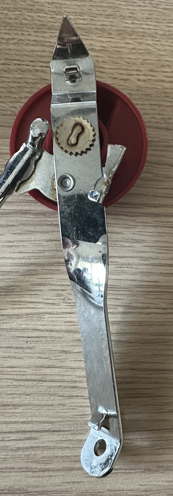
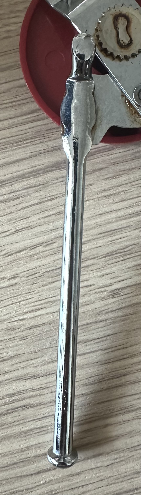
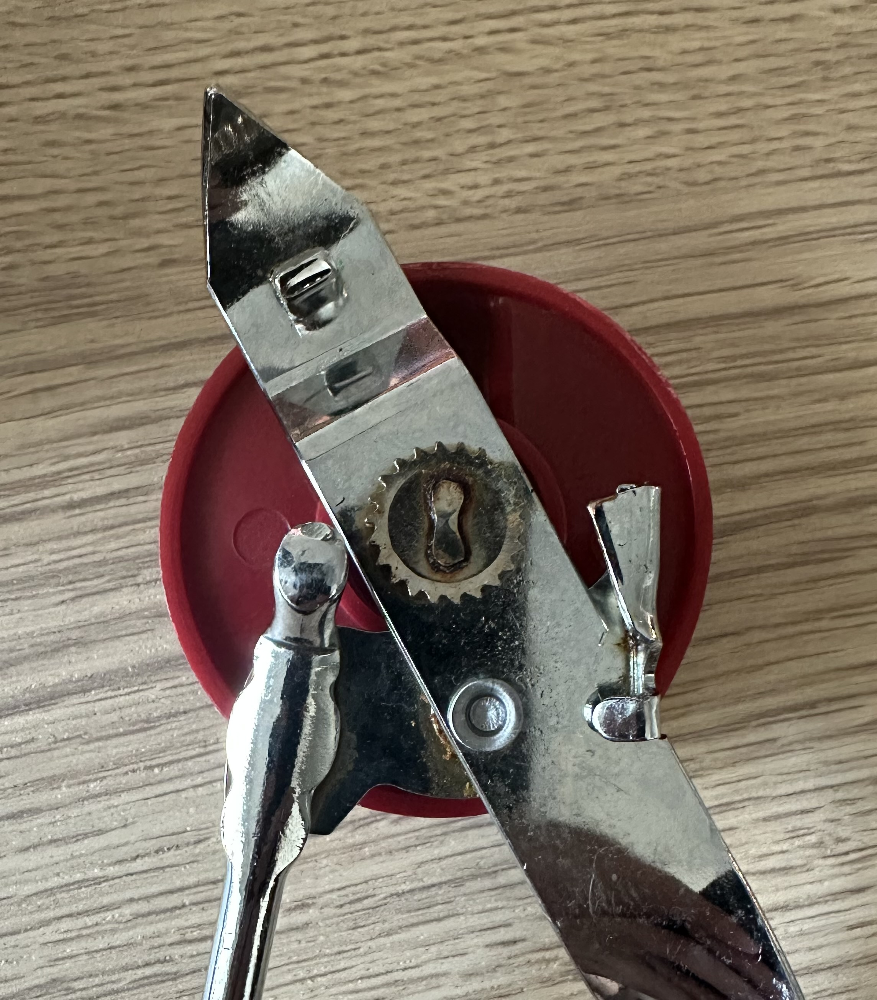

# A1 – [Build Your Professional Portfolio]

## Objective
The objective of A1 is to establish a professional engineering portfolio that demonstrates my ability to analyze mechanical systems, make and justify engineering decisions, and communicate my work clearly. Through analyzing existing engineering portfolios, evaluating a mechanical product, documenting design decisions, and establishing a documentation standard, I will create a foundation for presenting my engineering work throughout the semester.

## Analyze
## Task A: Portfolio Analysis
__**Online Engineering Portfolio: https://jacobschwartz.framer.ai/**__

**a.  Navigability : can a reader locate any specific assignment or piece of work in under 60 seconds?**
Projects are displayed individually with descriptive names and direct links to their project pages. This allows a reader to identify a relevant project without opening several unrelated pages. The structure is effective for an employer reviewing multiple projects quickly.

**b.  Reproducibility : does the documentation contain enough information that a colleague could reproduce the work without asking a question?**
The project pages provide more technical information than the first portfolio, including equipment, software, testing methods, drawings, and bills of materials. However, some projects still lack enough detailed calculations, dimensions, and assumptions to completely reproduce the work.

**c.  Evidence of reasoning : does the portfolio show how decisions were made, or only what the final answer was?**
This portfolio provides stronger evidence of engineering decisions. For example, some projects explain how testing or analysis was used to compare alternatives and select a design. This shows the process behind the result rather than only displaying the final product.

**d.  Professional tone : does the language meet the standard of a document you would hand to an employer?**
The portfolio uses technical language and focuses on engineering methods, project objectives, testing, and results. The descriptions are written for someone evaluating technical experience rather than for a general audience.

__**Github Engineering Portfolio: https://github.com/NateKarau61/Engineering-Portfolio**__

**a.  Navigability : can a reader locate any specific assignment or piece of work in under 60 seconds?**
The portfolio is easy to navigate from the main website because projects are separated into individual sections. However, the GitHub repository uses labels such as “Project_0” through “Project_6,” which makes it harder to identify a specific project without opening the folders. The website is more efficient for quickly locating work than the repository itself.

**b.  Reproducibility : does the documentation contain enough information that a colleague could reproduce the work without asking a question?**
The portfolio identifies the projects, software, and engineering skills used, but most projects do not provide enough calculations, dimensions, assumptions, or design requirements for another engineer to reproduce the work. It functions more as a record of experience than a complete engineering design document.

**c.  Evidence of reasoning : does the portfolio show how decisions were made, or only what the final answer was?**
The portfolio shows what projects were completed but provides limited information about how design decisions were made. The reader can see the final work, but there is less evidence of alternatives considered, calculations performed, or criteria used to select the final design.

**d.  Professional tone : does the language meet the standard of a document you would hand to an employer?**
The portfolio uses engineering-specific terminology such as CAD, GD&T, DFM, FMEA, and machining. This makes the content appropriate for an engineering employer and keeps the focus on technical skills and project experience.

## Task B: Product Analysis
**a.  What is the primary function of this product? State it as an engineering function : what mechanical task does it perform? State it precisely, not as a consumer description.**
The primary function of the manual can opener is to apply a cutting force to the rim of a metal can while simultaneously advancing the cutting mechanism around the can. The user provides rotational input through the turning knob. This rotation is transferred to the toothed drive wheel, which grips the can rim and moves the opener while the cutting wheel separates the lid from the can.

**b.  Identify the governing model : what equation or physical principle governs its primary behavior?**
  **i.  State the model and identify its variables.**
The primary governing model is the torque relationship: **Torque = r X F**
The torque is applied to the 

**ii.  State one assumption that makes the model valid for this product.**

**c.  Take photographs of each component. Under each photograph, describe precisely how the geometry of that component affects its mechanical function.**

The upper handle is a long metal plate that provides a lever arm for the user's hand and supports the cutting mechanism. The cutting wheel has a sharp circular edge that concentrates force onto a small area of the can rim, allowing it to penetrate and cut the metal as the wheel rotates. The toothed drive wheel provides traction against the can rim. Its teeth increase the contact between the wheel and rim so that rotational motion can be transferred into movement around the can.

The lower handle provides the opposing force that clamps the can between the cutting and drive mechanisms. The smooth pressure wheel contacts the underside of the can rim and rotates as the opener moves around the can. The pressure wheel is angled so that it contacts the underside of the rim while reducing contact with the vertical wall of the can. This reduces unnecessary friction while maintaining the force needed to keep the can engaged with the cutting mechanism.

The drive shaft transfers torque from the turning knob to the toothed drive wheel. Its cylindrical geometry allows it to rotate while maintaining the alignment of the drive and cutting mechanisms. The shaft's position also places the wheels at the correct location relative to the can rim.

**d.  Using patent research, identify the patent number and author(s). Then:**
  **i.  List at least two alternative solutions or devices that solve the same primary function.**

**ii.  Identify one design decision the original engineer made : something you can see in the patent or geometry : and explain why you think they made that choice.**

## Decide
**Homepage Identity** The homepage will immediately identify this site as my mechanical engineering portfolio and explain that it contains my engineering assignments, analysis, design decisions, and supporting documentation. I will organize the content by assignment so a hiring manager or engineering colleague can quickly locate a specific project and understand how the work was completed. The homepage will also state that the portfolio focuses on documented engineering reasoning, including assumptions, calculations, decisions, and results, so the reader knows what standard to expect from the work.

**One Intentional Customization** I changed the color scheme of the template to use a lighter blue accent color. This better supports the requirement for a professional engineering portfolio by making headings and navigation easier to distinguish while maintaining a simple appearance. The default color scheme did not provide enough visual separation between sections, so the change improves navigation without changing the overall structure of the template.

**Documentation Standard** Every assignment entry will state the governing model, assumptions, design decisions, supporting evidence, and results with enough detail that another engineering student could reproduce my work without asking me for additional information.

## Communicate

Check out the 'About Me' section.
