# A2 – Truss Stress Analysis

## Objective
The objective of this assignment was to design a lightweight planar truss capable of supporting the specified loads while maintaining the required factors of safety.

I designed a simple four-joint, five-member truss using members AB, BC, CD, AD, and BD, with a pin support at A and a roller support at B. The truss members were designed using A500 structural steel.

For this design, I selected an applied load of P = 25 kN, which is within the required range of 20–30 kN. The given geometric dimensions were a = 0.4 m and b = 0.3 m. A500 Structural steel has a specified minimum yield strength of 50 ksi and minimum tensile strength of 62 ksi.

## Analyze
**Truss Geometry**
I selected a five-member truss consisting of members AB, BC, CD, AD, and BD.

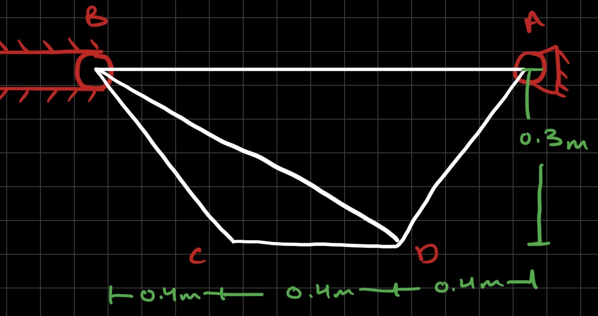

The geometry creates two triangular regions, BCD and BAD. This is useful because triangles provide geometric stability without requiring unnecessary additional members.

**Member Lengths**
The lengths of each member can be found using simple geometry.

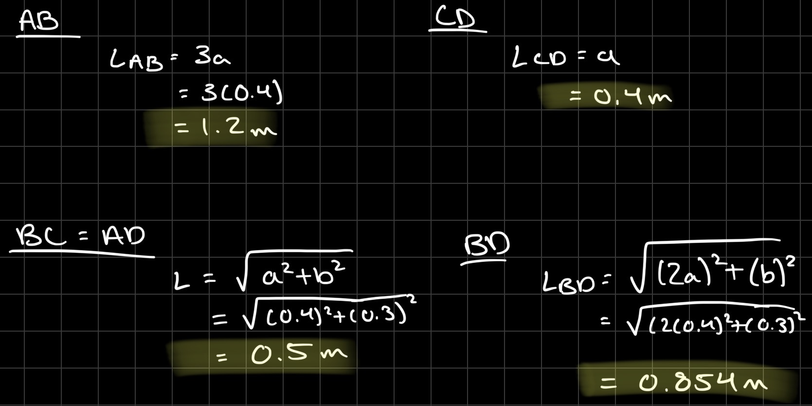

**Truss Free-Body Diagram**
The pin at A can produce horizontal and vertical reactions, while the roller at B produces only a vertical reaction. For the FBD, only the entire truss and these five external forces need to be drawn. This is to show the overall FBD of the truss without showing the internal member forces.

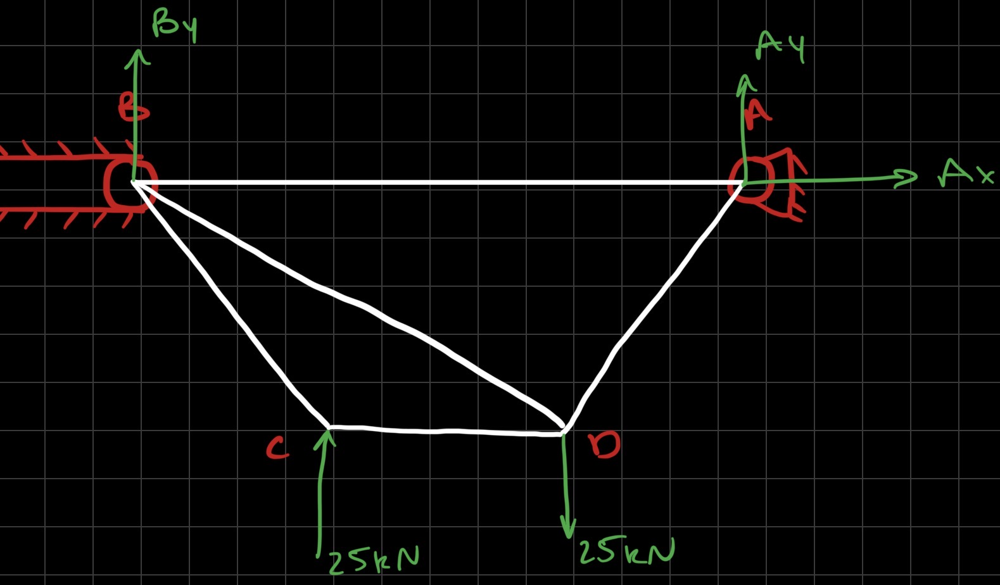

I found the support reactions using basic equilibrium equations and moment about point B.

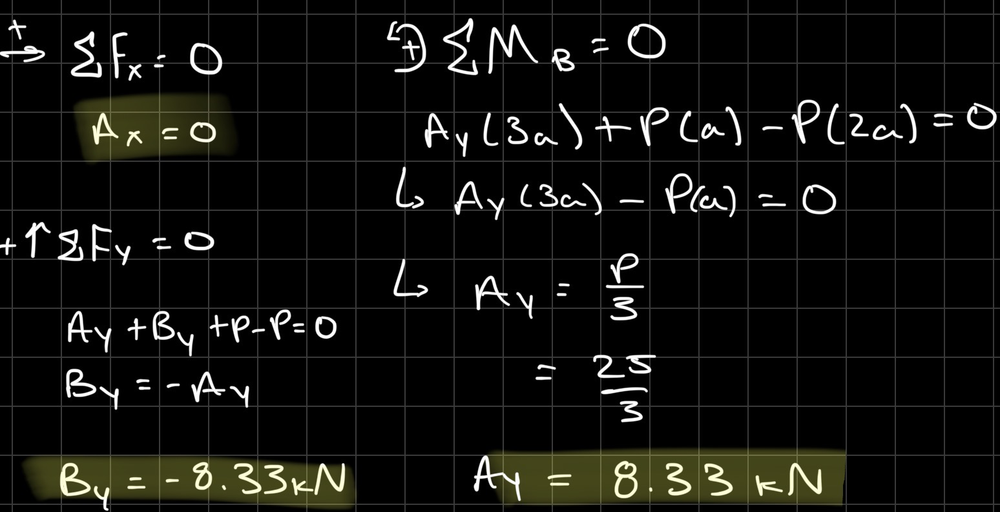

**Joint Analysis**
For the method of joints, I assumed every unknown member force was initially in tension, meaning the force arrows point away from the joint. A positive answer therefore represents tension and a negative answer represents compression.

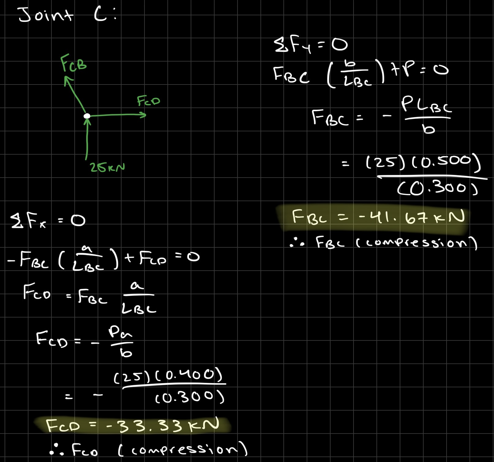

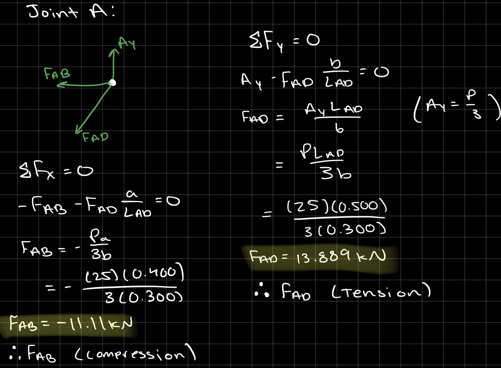

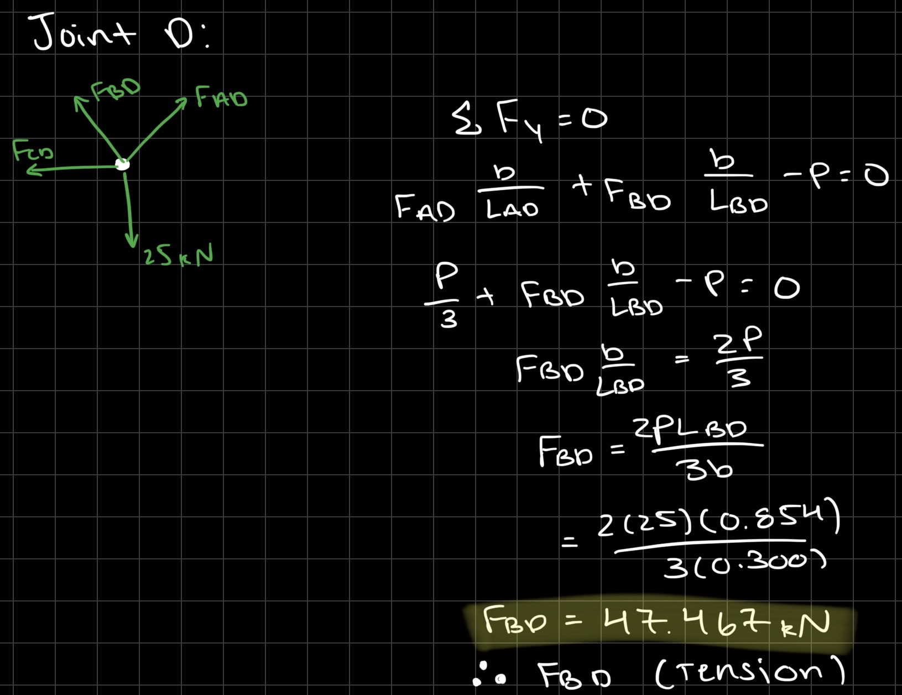

I found the internal forces to be:
AB = -11.11 kN (Compression)
BC = -41.67 kN (Compression)
CD = -33.33 kN (Compression)
AD = +13.89 kN (Tension)
BD = +47.47 kN (Tension)
With this information, I concluded that Fmax = 47.47 kN.

**Member Cross-Section Design**
It is known that Fmax = 47.47 kN, the factor of safety, N = 3.5, and for A500 structured steel Fy = 50 ksi = 344.73 MPa; this is the minimum yield strength for A500 structured steel. The unknown is the minimum area.

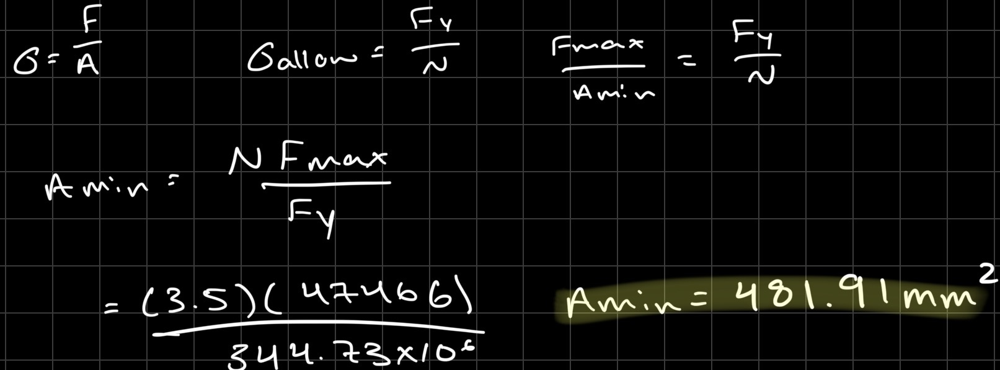

With that information, I was able to find the minimum area required to be 481.91 mm^2.

**Approximate Truss Weight**

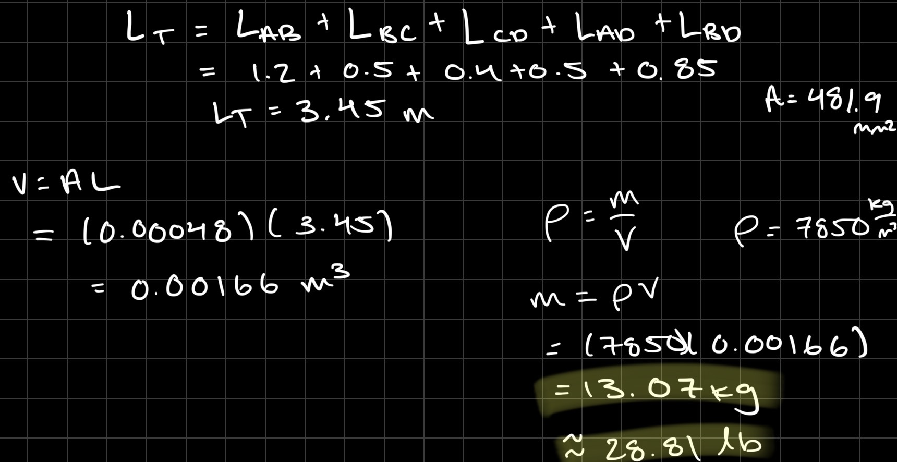

I was able to determine the theoretical weight of the truss members to be 13.07 kg.

**Pin Design**

All four pins are required to be identical. The knowns of the pins are Vmax = 47.467 kN, yield shear strength = 170 ksi, N = 4, density = 0.278 lb/in^3. The unknowns are Apin and dpin.

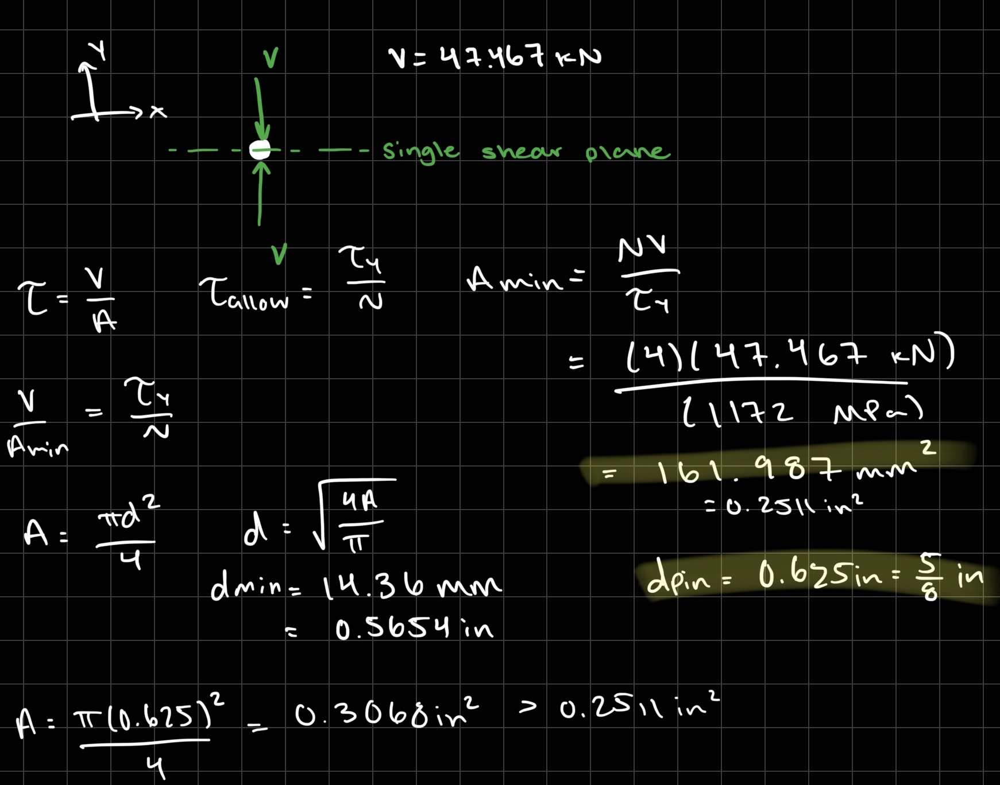

With this information calculated, I was able to determine the combined weight of the pins to be = 0.5970 lb.

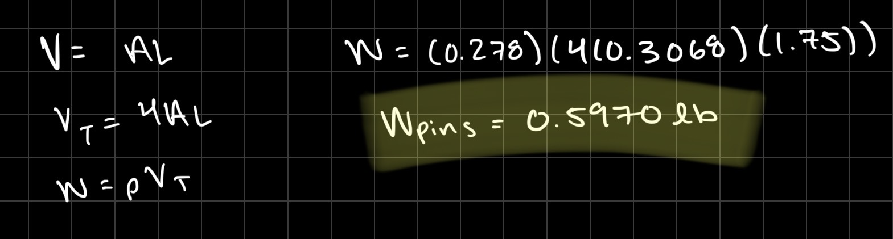

**CAD Construction**

For a simple CAD model, I had to find the dimensions of the members. 

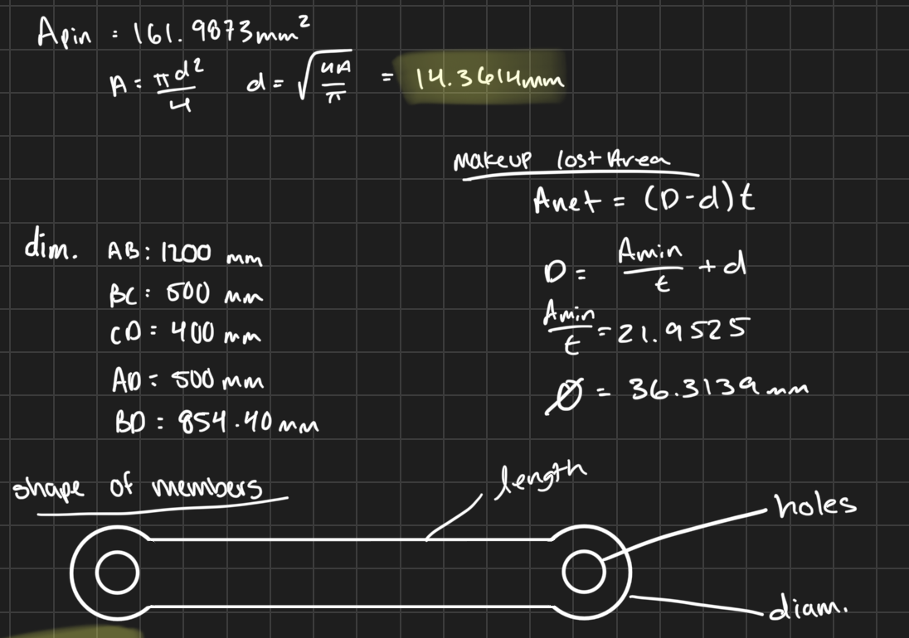

For the members, I had to extend the ends to fit the pins in the center while maintaining the minimum required area that I had calculated earlier. I then modeled the truss in SolidWorks as one part, excluding the pins. The pins were modeled separately as cylinders using the calculated cross-sectional areas and lengths, then added to the final assembly.

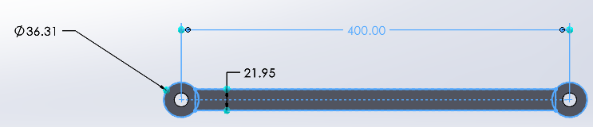

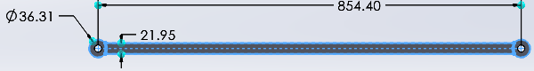

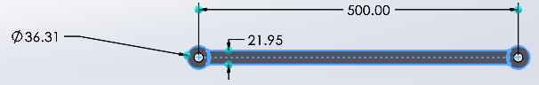

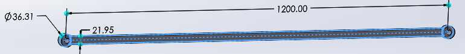

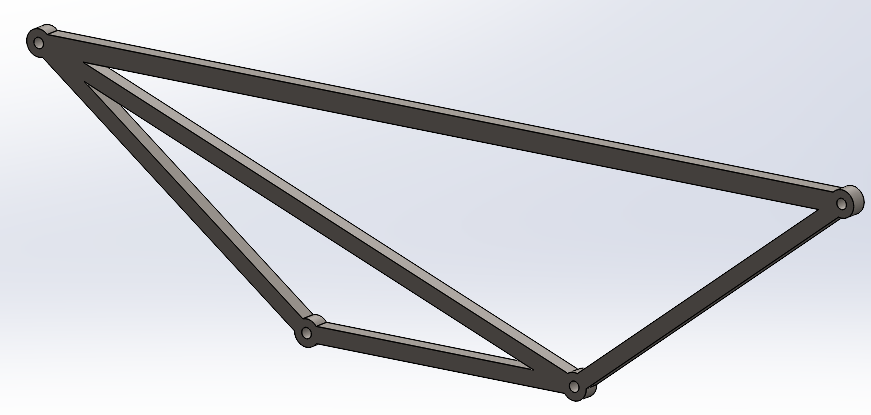

The required cross-sectional area of each truss member was maintained through the pin-joint intersections so that the CAD model accurately represented the dimensions used in the structural analysis.

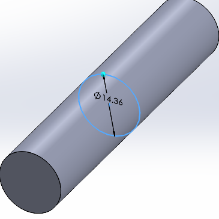

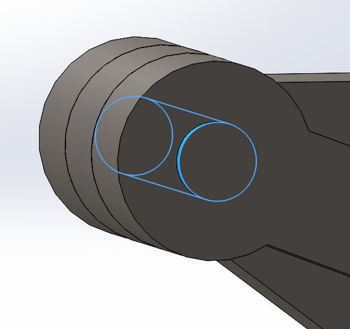

The appropriate materials were assigned to the truss and pins. The SolidWorks Mass Properties tool was then used on the complete assembly to determine the predicted mass and weight of the final design. I checked the weight of the truss without the pins, only the pins, and the combined weight of the members and the pins.

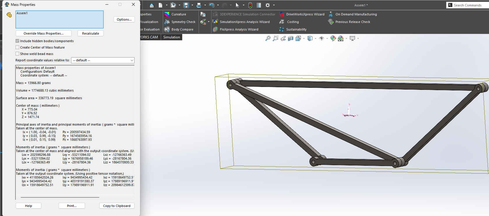

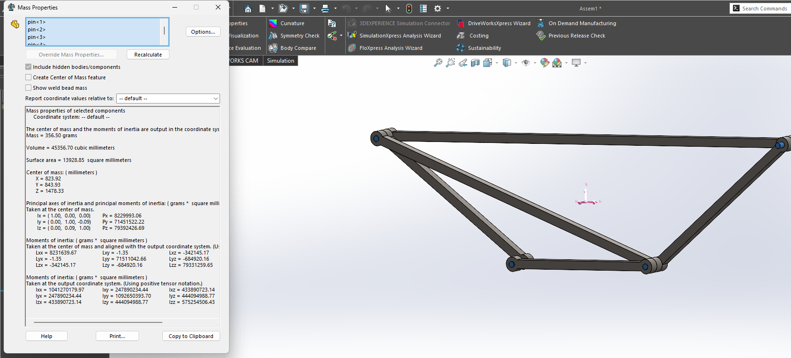

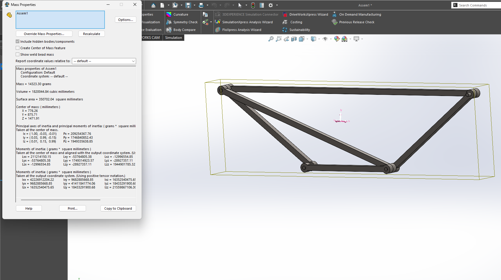

The final measured weight of the truss was 14.3 kg, which was not far off my calculated weight of 13.97 kg.

**Likelihood of Failure Modes**

The truss members are made of ductile structural steel and experience either axial tension or compression. Tension members are most likely to fail by yielding before fracture, so the members were sized so that the axial stress remained below the allowable stress based on the selected safety factor. Increasing the cross-sectional area near pin holes or adding gusset plates could further reduce stress concentrations.

Compression members are more likely to fail by buckling, especially when they are long and slender. Buckling can occur before the material reaches its yield strength, so member length and stiffness are important. Increasing the moment of inertia or adding bracing would reduce the likelihood of buckling.

The pins are most likely to fail in shear because they transfer the member forces through the joints. The pin area was sized using the maximum internal force, the pin material shear strength, and the required safety factor. Increasing the pin diameter, using double shear, or increasing the bearing area around the pin hole would further reduce the chance of connection failure.

**Pin Connections**

The primary expected pin failure mode is shear failure because the pins are loaded in single shear. Using the specified 170 ksi shear yield strength and a safety factor of 4 gives an allowable shear stress of 42.5 ksi. Increasing the pin diameter or changing the connection to double shear would reduce the likelihood of pin failure.

Sources Used:

https://study.madeeasy.in/ce/design-of-steel-structures/types-of-failure

https://www.fema.gov/pdf/emergency/usr/module1c2.pdf

https://www.hawkins.biz/insight/steel-structure-failure-mechanisms/

https://www.fixfast.com/skills-hub/what-are-the-various-failure-modes-of-fastener-connections

[Member AB](memberAB.SLDPRT)
[Member BC and AD](memberBC_AD.SLDPRT)
[Member BD](memberBD.SLDPRT)
[Member CD](memberCD.SLDPRT)
[Truss Assembly](trussasm.SLDASSM)

## Decide
I selected the AB-BC-CD-AD-BD geometry because it creates a stable truss while using only five structural members. A planar pin-jointed truss with four joints and three support reactions satisfies the basic determinacy relationship **m+r=2j**. For this design, **(5)+(3)=2(4) -> 8=8**, so the structure is statically determinate. This geometry was preferred over a design containing additional members because additional members would increase material volume and weight without being necessary to satisfy static determinacy.

I selected P = 25 kN because it is the midpoint of the permitted loading range rather than selecting the minimum possible load simply to reduce the required cross-sectional area. The calculations showed that BD experiences the greatest member force at 47.467 kN, so that member controlled the cross-sectional-area design.
