# A3 – Parametric and FEA

## Objective
For this assignment, I was tasked with designing a beam with a circular cross-sectional area and using two types of analysis: axial deformation and finite element analysis. The beam was to be designed from aluminum and subjected to a force between 300 and 500 lbf with a maximum deflection of 0.009 inches. The Young's Modulus of the beam had to fit within the range of (8.5 - 11.5) *10^6 psi.

## Parametric Design
**Beginning Design**

I began the design process by selecting the geometry of the beam. I chose the beam to have a diameter of 0.70 inches. I also chose 420 lbf as my force to be applied to the end of the beam, and a Young's Modulus of 10x10^6.

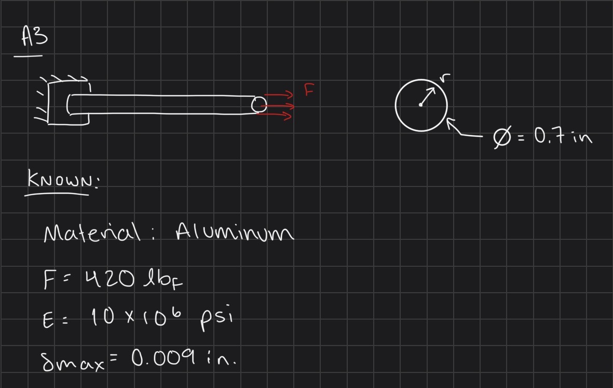

After choosing the geometry and parameters of the beam, I calculated the cross-sectional area to be 0.3848 inches^2 by using the area formula for a circle (pi x d^2)/4. Then, using the direct tension elongation equation and moving it to solve for length, I found the length of the beam, with a 0.70 inch diameter, to be 82.46 inches.

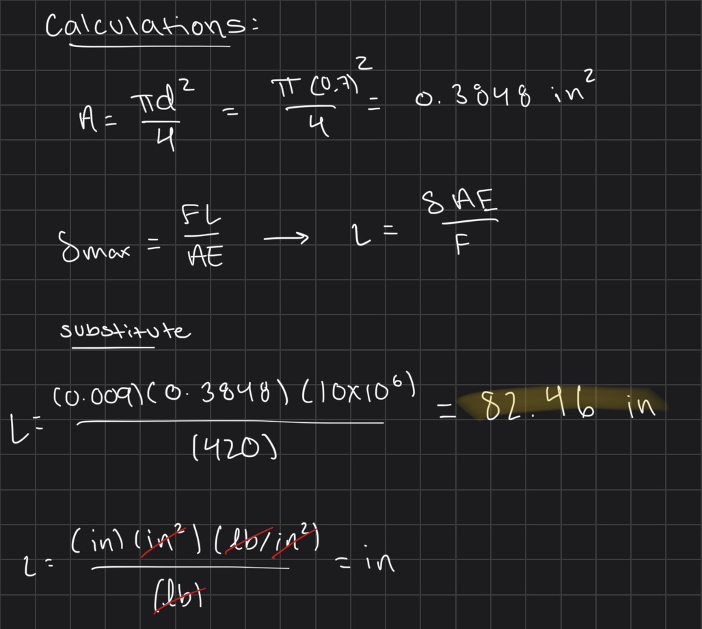

**CAD Design**

To make my model and conduct an FEA, I decided to use SolidWorks. I began making my model by assigning all of my parameters to parametric equations.

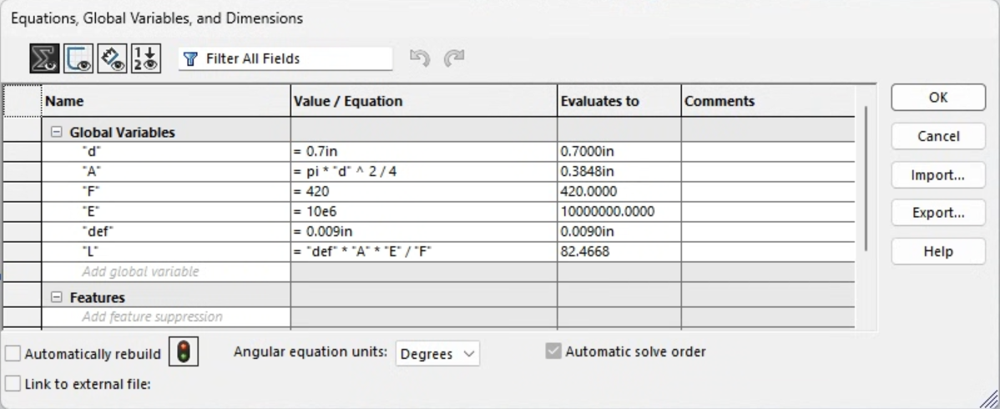

Then I made a circle sketch on the front plane using the diameter parameter and extruded using the length parameter equation.

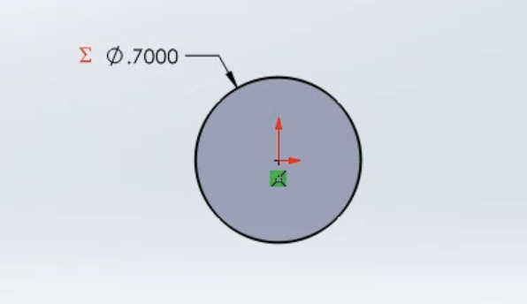
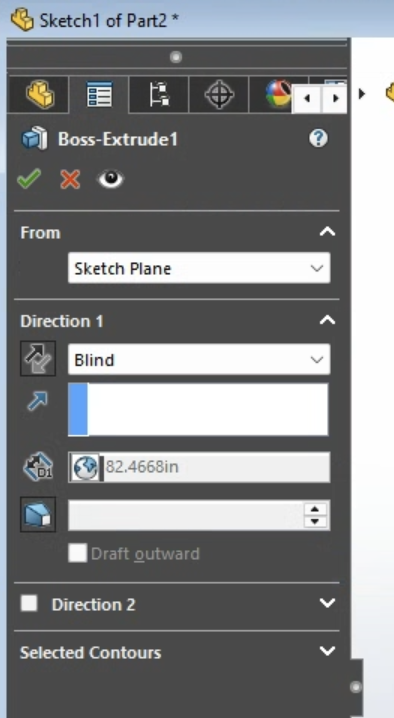
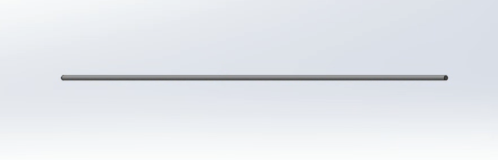

## FEA
**FEA Setup**

To conduct an FEA, I added 420 lbf to one face of the beam, and on the opposite face I added a fixed geometry to represent a fixed support.

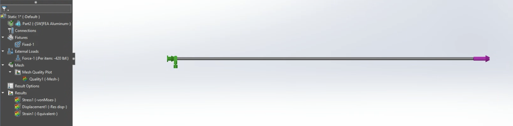

I also needed to add a material to perform an FEA; however, when I looked through the SolidWorks materials, I did not see an aluminum with a modulus of 10x10^6 that I had chosen for my calculations. To combat this issue, I created a custom aluminum material with a Young's Modulus of 10x10^6 psi and a Poisson's Ratio of 0.33, which I found was common for aluminum materials, and using those two values, I calculated the Shear Modulus to be 3.76x10^6 psi. All of these values were needed to make the custom material.

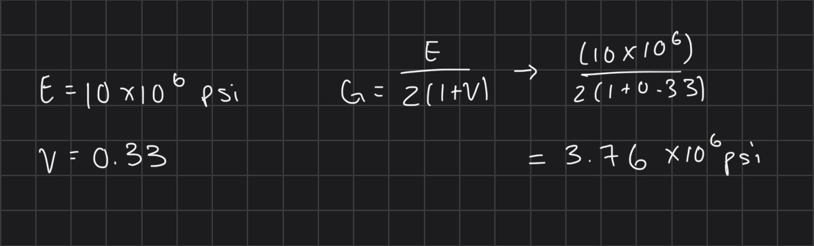
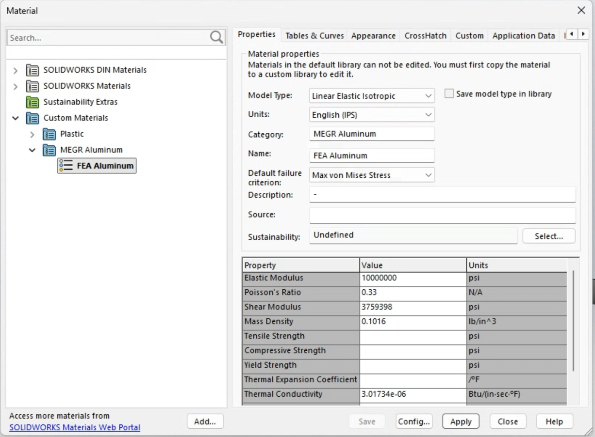

**FEA Results**

Then I conducted an FEA and generated the deflection map.

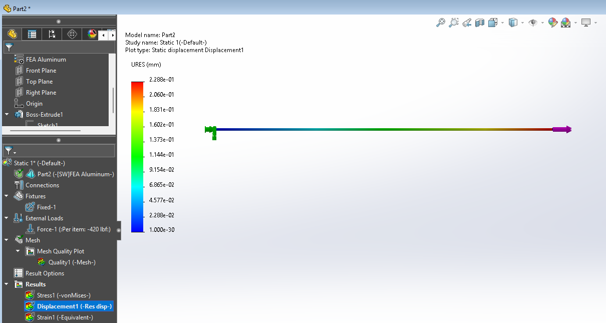

I also generated the von Mises stress map.

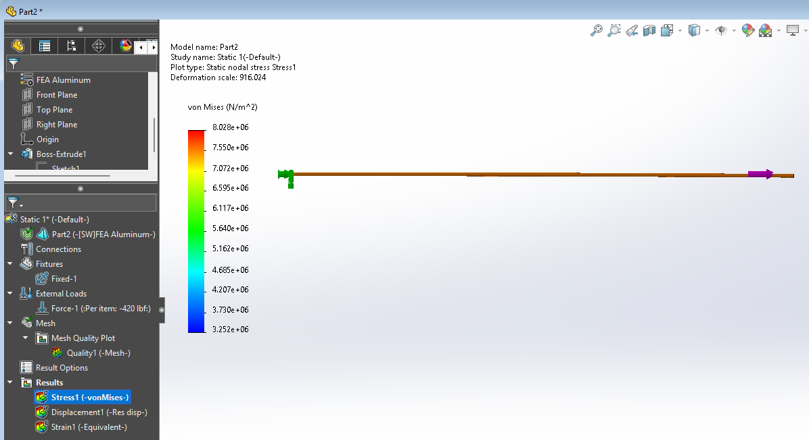

The von Mises stress map shows that the maximum stress is 8.028x10^6 N/m^2, which I converted to ksi units, and it converts to 1.164 ksi. Using this, I compared it to the 40 ksi stress of aluminum and found that the safety factor was 34.36.

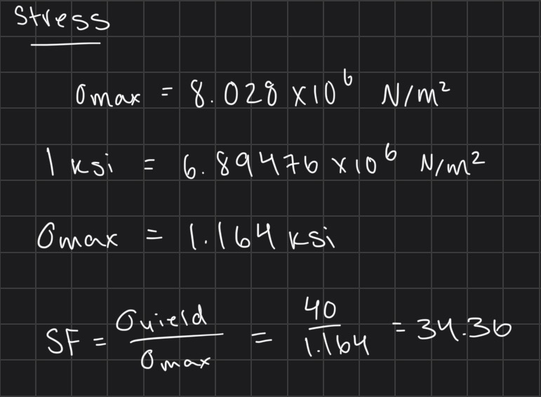

## Design Reflection

The deflection from my FEA was 0.2288 mm, which I converted to 0.00901 inches. The percent difference between the two results is approximately 0.11%. The results are essentially the same because the bar has a uniform circular cross-section and is primarily subjected to simple axial loading. The hand calculation assumes uniform stress and deformation along the bar, which closely matches the conditions in the FEA model. Therefore, there are no major stress concentrations or complex loading effects causing a significant difference. I would trust the FEA result slightly more because it accounts for the actual model geometry and boundary conditions, while the hand calculation uses simplifying assumptions. However, the close agreement between the two results confirms that the hand calculation is a good representation of the bar's behavior.

**Pin Hole Analysis**

## Modify Design Parameters

## Lessons Learned

## CAD File

! [Beam Model](beammodel)
