# A4 – Motor Mount

## Objective

The objective of this assignment was to design a motor mount for the provided 24 V brushed DC gear motor and attach it securely to rigid wall A. The motor is subjected to a 300 N force at the shaft.

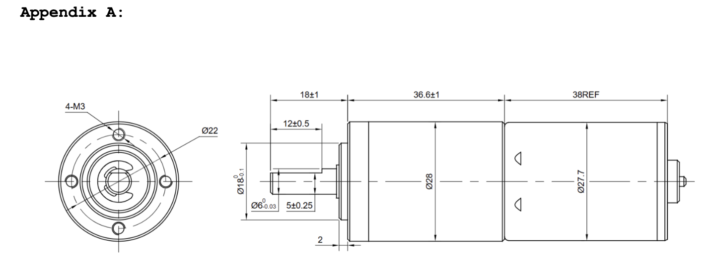

The mount was required to be designed using beam-bending equations for both yield strength and deflection. A factor of safety of 3 was required, and the maximum allowable deflection at the free end was 0.30 mm. The material had to be selected from PLA, PETG, or ABS.

The mount was divided into two main sections: Feature 1, which supports and attaches to the motor, and Feature 2, which attaches the mount to a rigid wall.

I began the design process by establishing the known values and my assumed values.

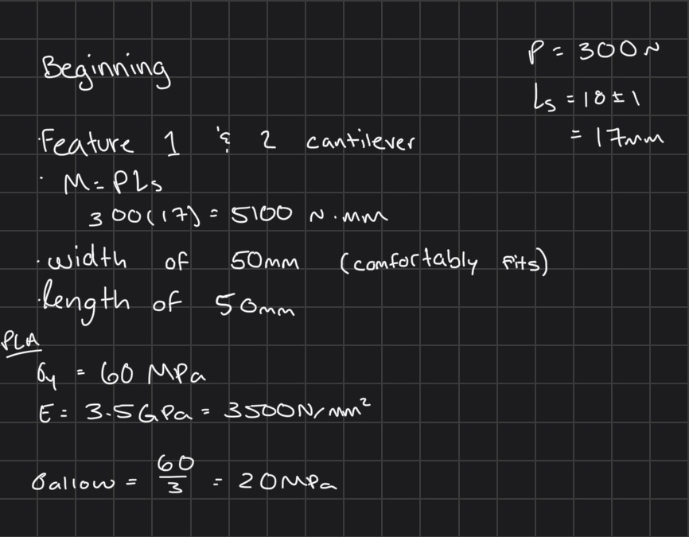

## Feature 1

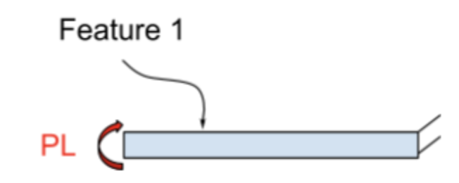

I designed the exposed mounting face of feature 1 to be 50mm x 50mm x 14mm. A 50 mm mounting face provides enough room for the approximately 28 mm diameter motor body, shaft clearance, and four motor mounting screws.

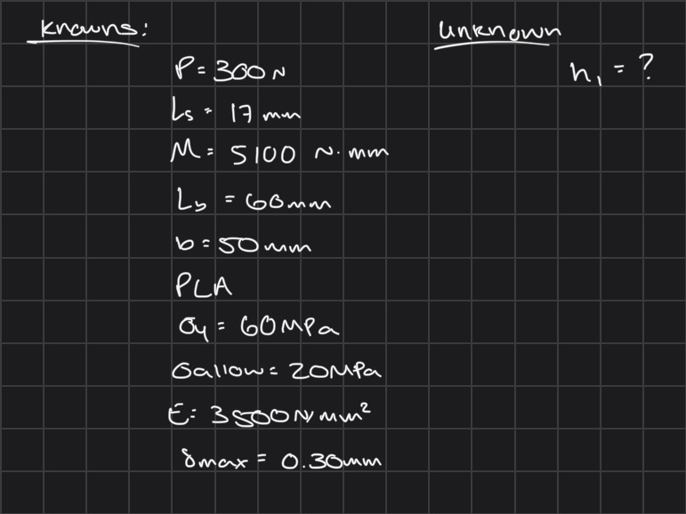

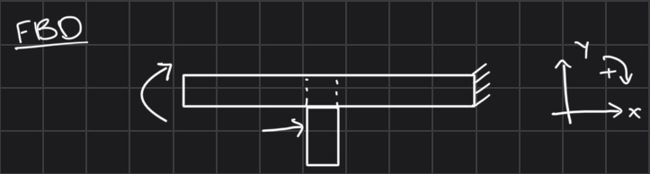

I calculated the required thickness of the beam using both stress and deflection analysis. This is where I calculated the 14mm thickness that I tested and it complied with the minimum allowable stress of 20MPa and maximum deflection of 0.30mm.

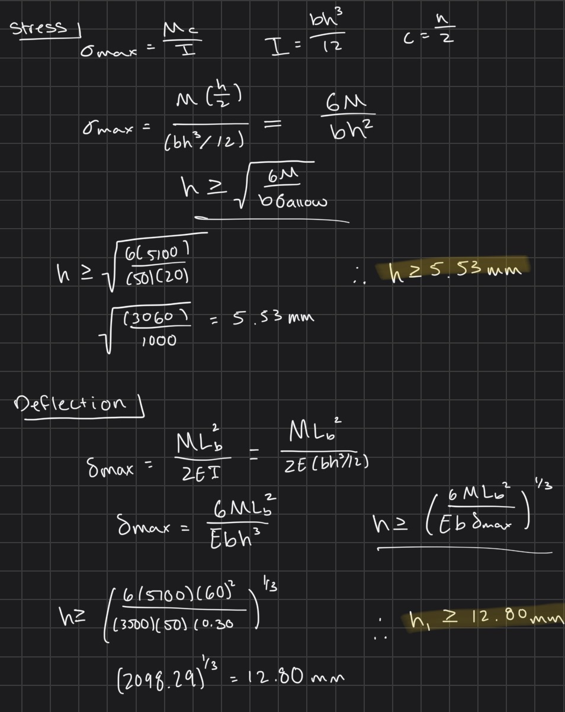

The motor mounting face also includes: four 3.4mm M3 clearance holes, a central shaft clearance hole, and a shallow center recess for the from motor locating feature.

## Feature 2

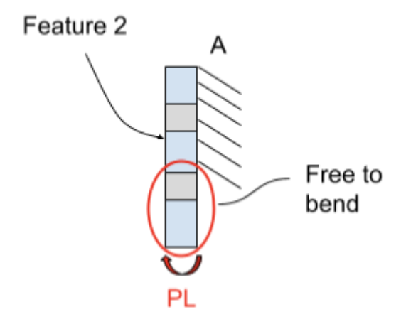

I designed the exposed mounting face of feature 2 to be 50mm x 50mm x 14mm. Using the same thickness for both features simplifies the design and makes the final bracket easier to model and manufacture.

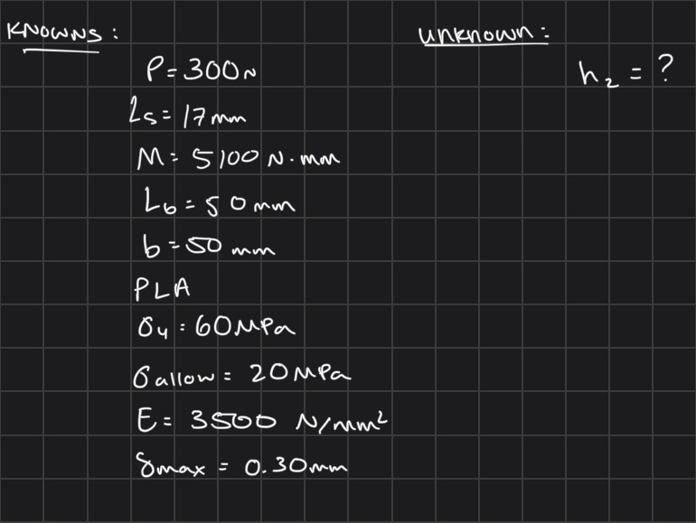

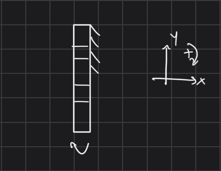

The same beam bending stress and deflection analysis approach used for Feature 1 was applied to Feature 2. The required thickness was determined from the allowable stress after accounting for the required safety factor.

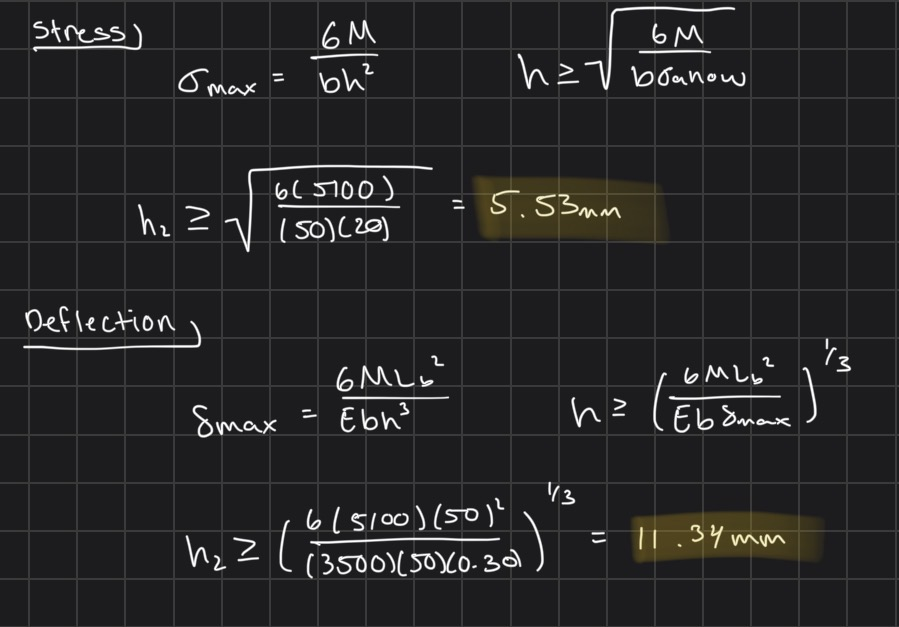

The wall mounting face includes 3.4mm clearance holes for the M3 bolts.

## Isometric Sketch

Before creating the CAD model, I made an isometric sketch of the proposed motor mount.

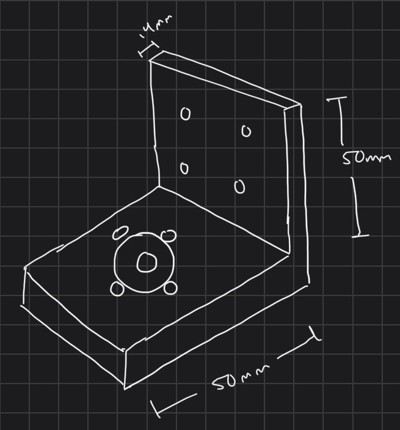

## CAD Modeling

The motor mount was modeled in SolidWorks using parametric equations and global variables. This allows important dimensions to be changed from one location instead of manually editing several sketches.

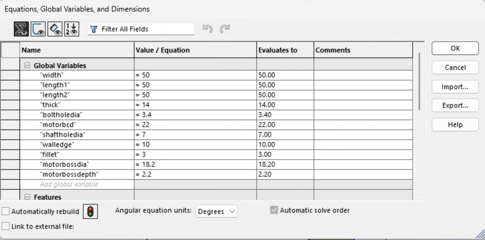

The main L-shaped side profile was sketched first. The exposed horizontal and vertical faces were both dimensioned using the global variables. The profile was then extruded to the 50 mm width.

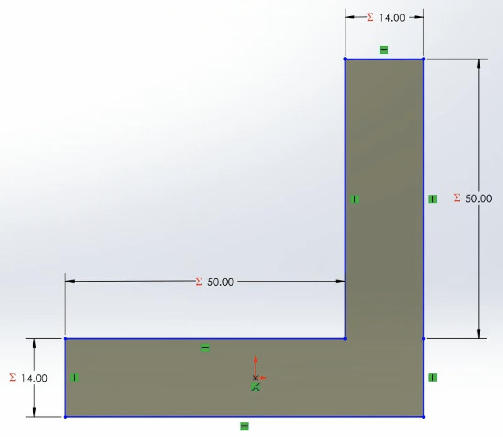

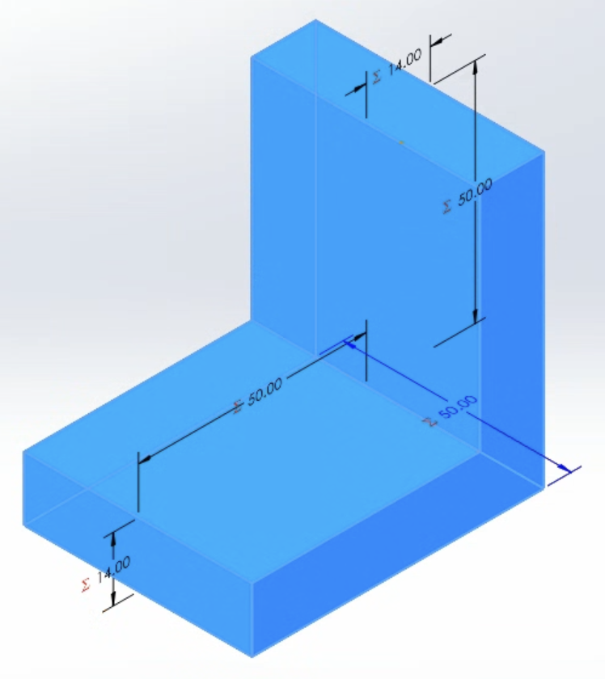

On the top face of Feature 1, I added the features needed to attach the motor. These included: a center shaft clearance, motor locating recess, four M3 clearance holes.

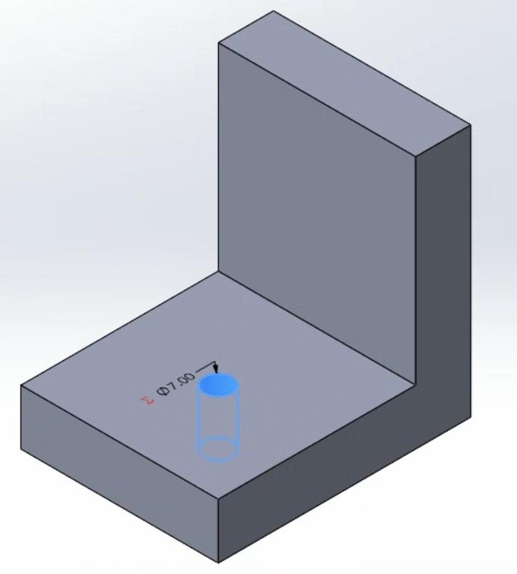

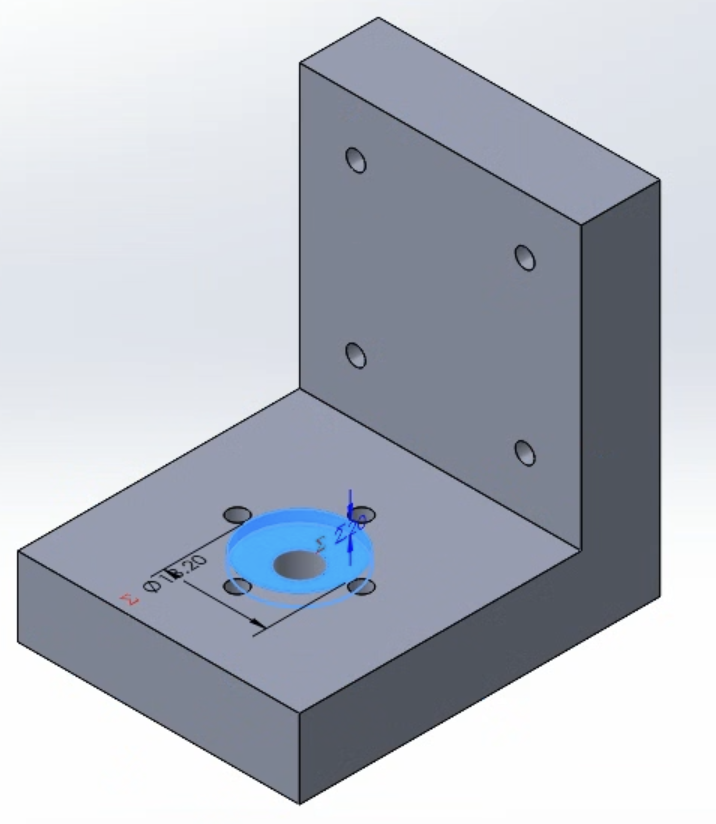

For the M3 clearance holes, I used a circular pattern to get the holes evenly spaced.

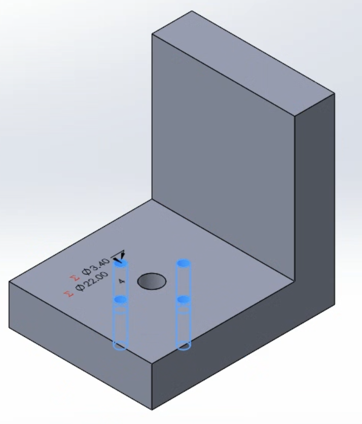

The vertical face of Feature 2 was given clearance holes for attaching the bracket to rigid wall A. These holes were also created using a circular sketch to get even spacing.

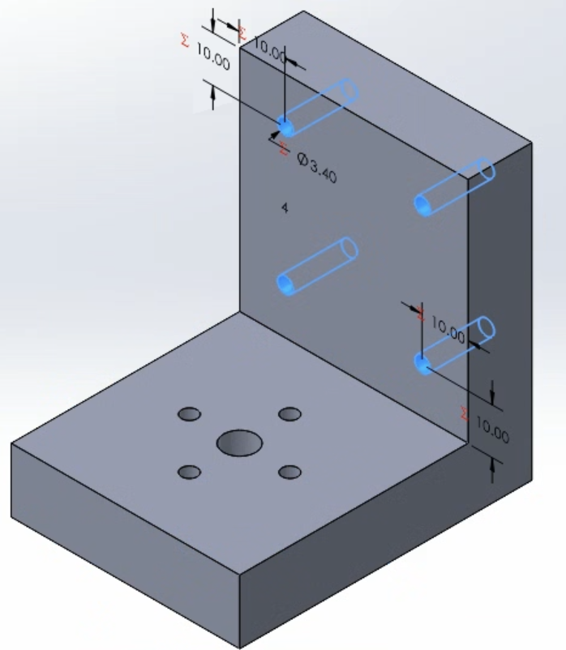

A small fillet was added to the inside corner between Feature 1 and Feature 2 to remove the sharp corner without interfering with the motor mounting surfaces.

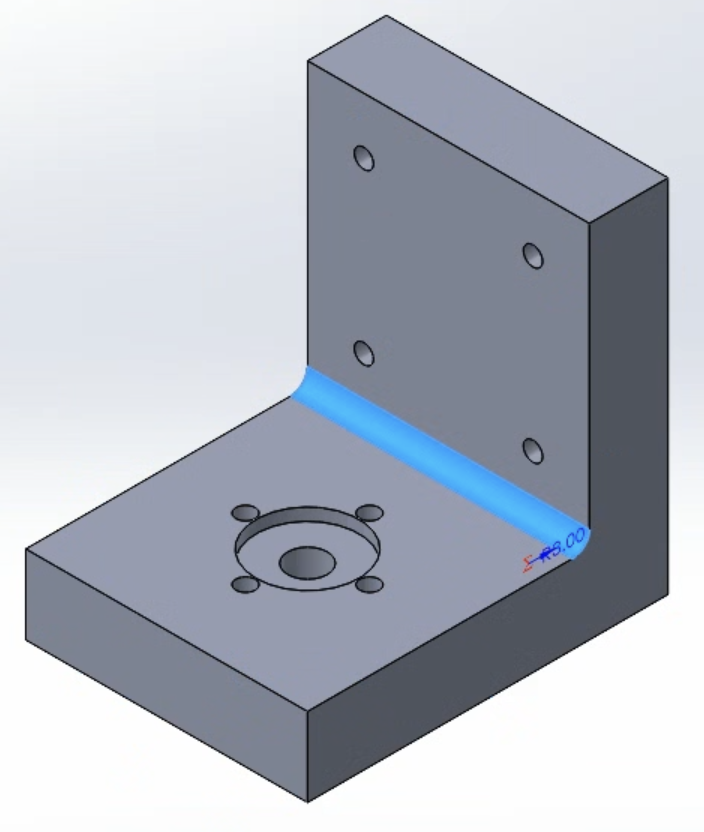

This completed the CAD model of the motor mount.

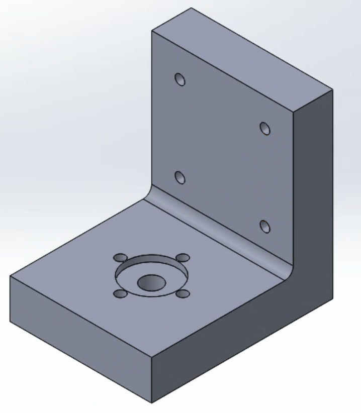

## CAD Drawing

[Click to download **SolidWorks Part**](mount.SLDPRT)
[Click to download **SolidWorks Drawing**](mount.SLDDRW)
[Click to download **Drawing PDF**](mount.pdf)

