# A5 – Bracket Design

## Objective

This assignment is to design a metal bracket that holds a polyester strap while the strap applies a horizontal force. The bracket fits onto a rigid T-shaped beam. The provided concept shows a round pin for the strap connected to a hanger below a T-shaped opening. The opening engages the rigid beam, so the force must travel from the pin through the bracket and into that support.

I need to determine the minimum dimensions of five bracket features, labeled A through E in the assignment. For each feature, the assignment requires a free body diagram and a strength calculation to prevent yielding, followed by a stiffness calculation to limit movement. I also need two separate paper multiview sketches, one based on stress and one based on stiffness, plus a reflection on the design choices and corrections. The calculation images below provide the detailed math; this page explains the design process and results.

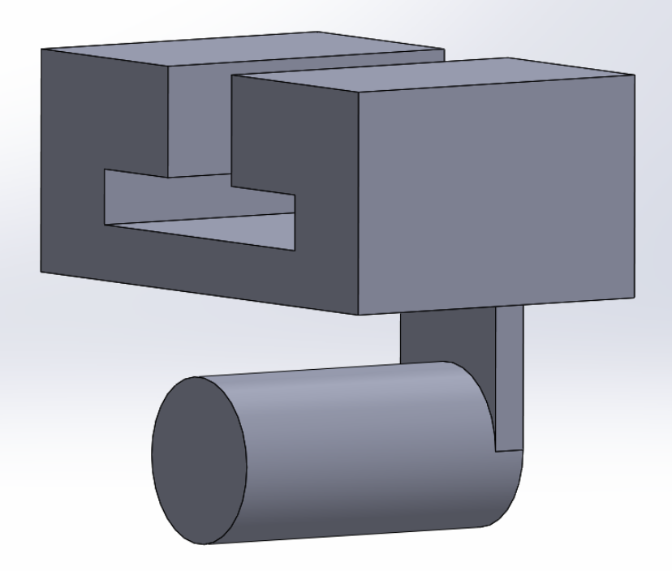

A is the strap pin, B is the hanger, C is the lower crossmember, D represents the side webs, and E represents the upper lips around the opening for the rigid support.

## Design Process

**Design Requirements**

I selected a 700 lbf force for each symmetric strap side within the assigned 500–800 lbf range. Under that load interpretation, the two sides apply 1,400 lbf to Feature A. I chose 6061-T6 aluminum and used a safety factor of 4. Each feature is limited to 0.005 in of deflection; the preliminary calculations use a 40 ksi yield strength and 10 Msi elastic modulus.

The concept image has no scale, so I assumed the working lengths and 0.75 in section depth shown in the calculation screenshots. The T-beam opening and fit dimensions a, b, and c still need to be measured before these sketches can serve as fabrication drawings.

## Stress Analysis

**Feature A**

The strap loads the cylindrical pin along its length. The screenshot records the applied load, support reaction, stress model, and minimum stress dimension.

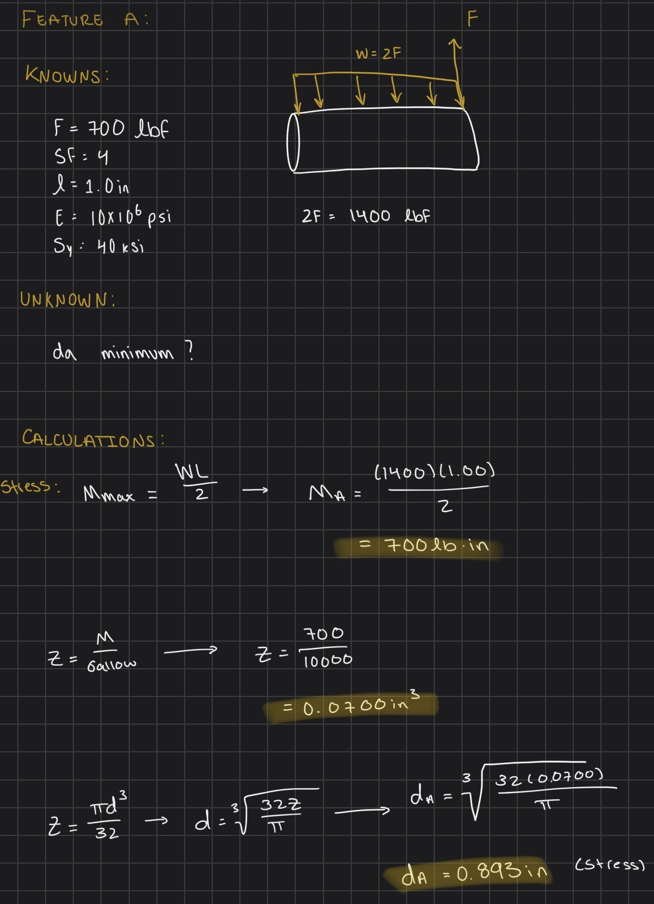

**Feature B**

I carried A’s support reaction into the vertical hanger and modeled its rectangular section in axial loading. The screenshot records the applied load, support reaction, stress model, and minimum stress dimension.

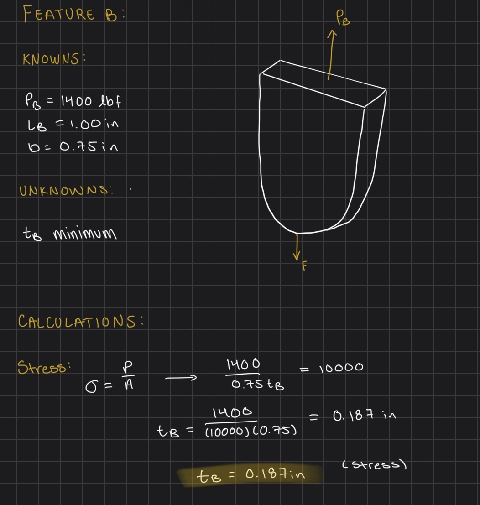

**Feature C**

I applied B’s load at the center of the lower beam. The screenshot records the applied load, support reaction, stress model, and minimum stress dimension.

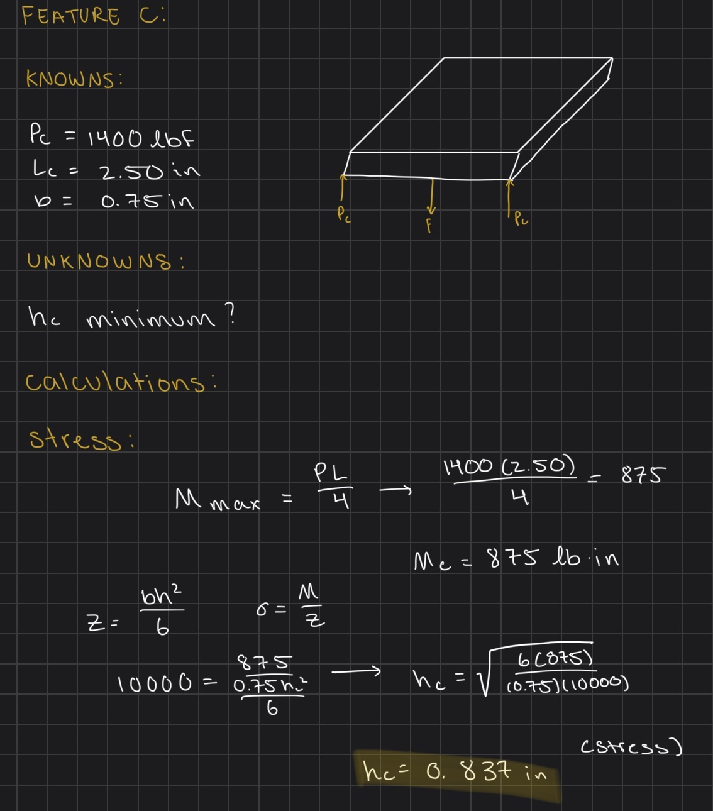

**Feature D**

Each side web receives one reaction from C. The screenshot records the applied load, support reaction, stress model, and minimum stress dimension.

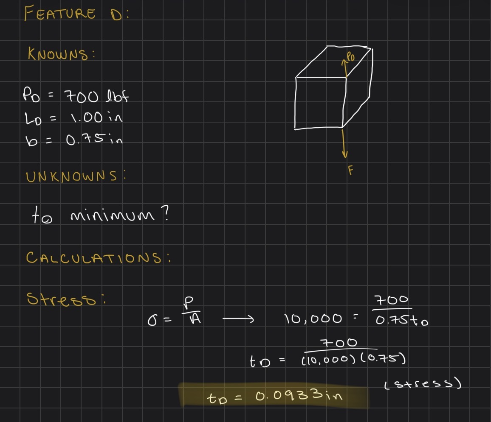

**Feature E**

I treated each upper lip as a short cantilever carrying the reaction passed through D. The screenshot records the applied load, support reaction, stress model, and minimum stress dimension.

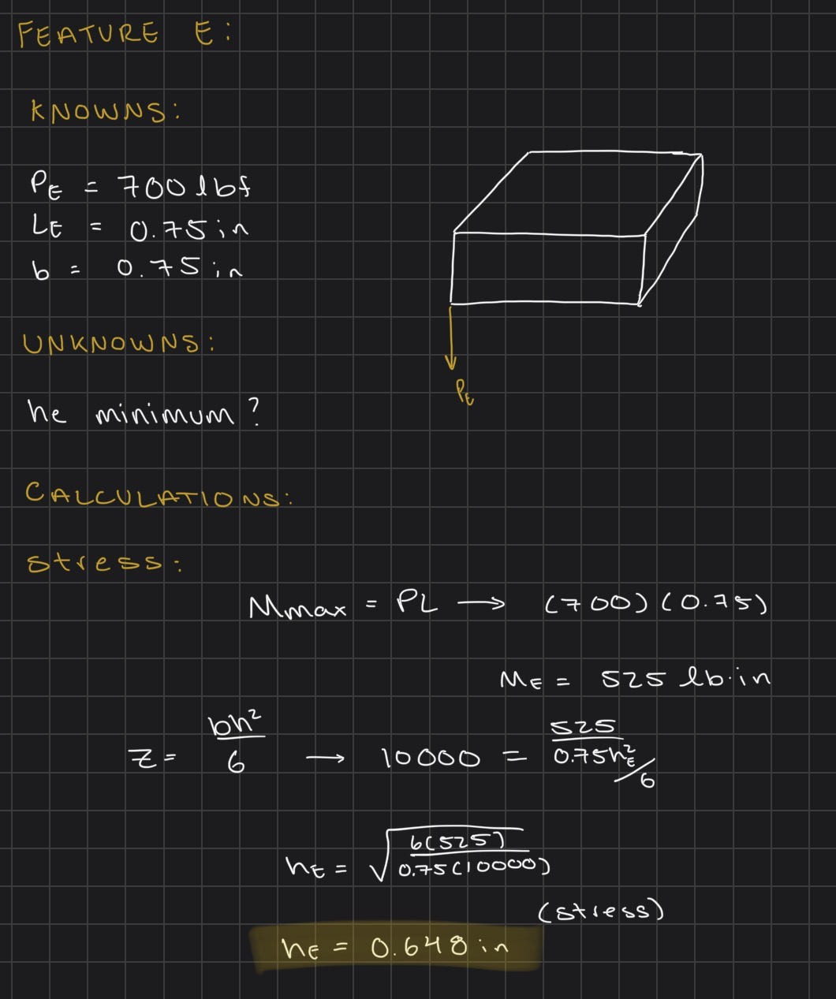

## Stiffness Analysis

**Feature A**

I repeated the same force path using a 0.005 in deflection limit for each feature. The beam checks use bending deflection, while the axial members use elongation.

I used the same load and assumed span as the stress analysis, then solved for the minimum section dimension that meets the deflection limit.

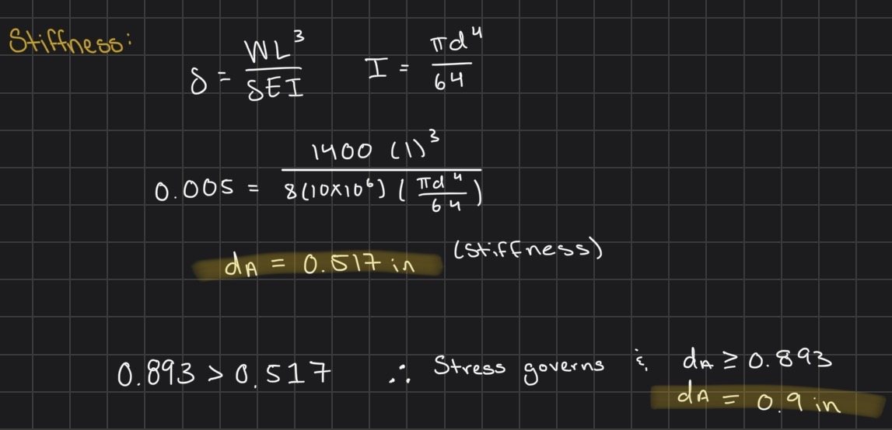

**Feature B**

I used the same load and assumed span as the stress analysis, then solved for the minimum section dimension that meets the deflection limit.

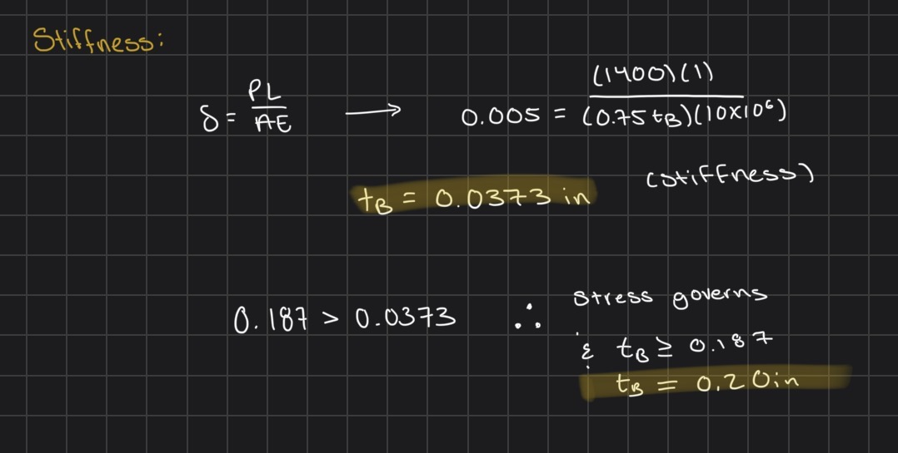

**Feature C**

I used the same load and assumed span as the stress analysis, then solved for the minimum section dimension that meets the deflection limit.

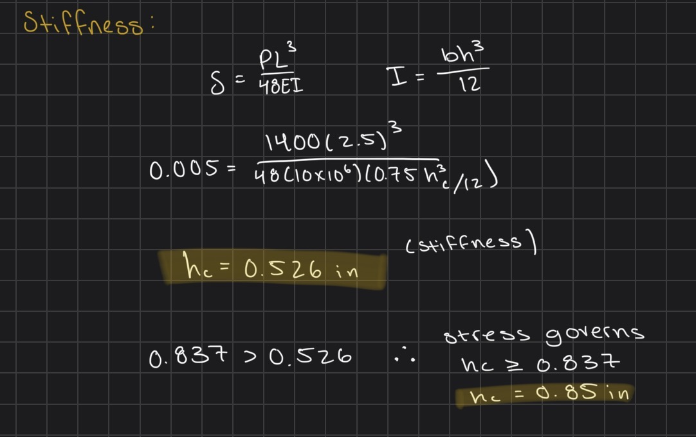

**Feature D**

I used the same load and assumed span as the stress analysis, then solved for the minimum section dimension that meets the deflection limit.

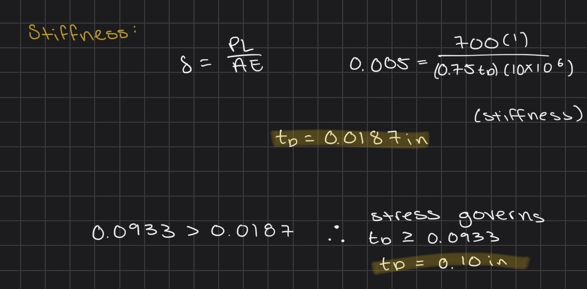

**Feature E**

I used the same load and assumed span as the stress analysis, then solved for the minimum section dimension that meets the deflection limit.

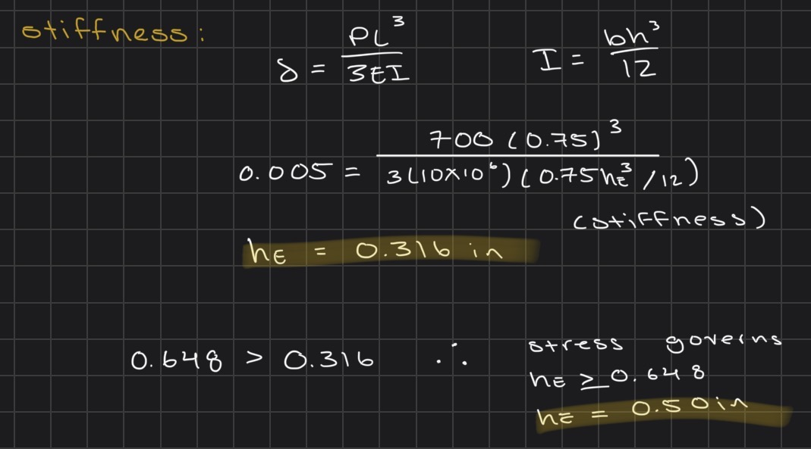

## Dimensions and Multiview Sketches

**Dimension Comparison**

Stress governed all five preliminary sizes. I rounded each governing minimum upward for the selected dimensions. These are idealized section sizes; the thin web and the corners where features meet require additional checking if this bracket is built.

**Multiview Sketches**

The front, top, right-side, and isometric views label the five minimum dimensions from the stress analyses. Redraw this as one paper multiview sketch and add the measured T-beam fit dimensions.

The same views show the stiffness-only minima so the two analysis methods can be compared directly. Redraw this separately on paper.

## Lessons Learned

**Governing Requirement**

For Feature C, stress required 0.837 in while stiffness required 0.526 in, a 0.311 in difference. The larger stress dimension sets the preliminary height.

**Error Propagation**

C’s two 700 lbf reactions become the D and E loads. Using 700 lbf instead of 1,400 lbf at C would incorrectly halve both of those reactions and undersize the later features.

**Assumption Sensitivity**

The beam deflection terms depend strongly on unsupported length. If the actual C span is longer than the assumed 2.50 in, its stiffness requirement rises; I must update the span and recalculate before using the dimensions in a finished design.
