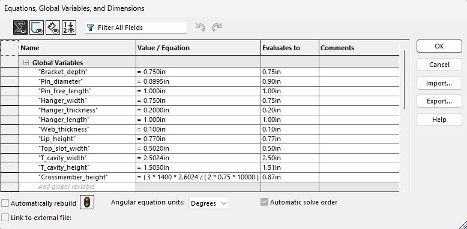
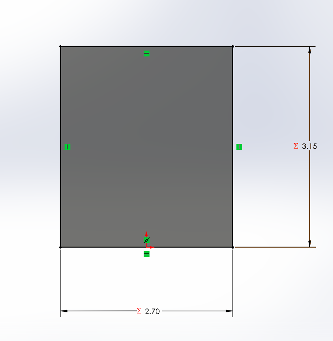
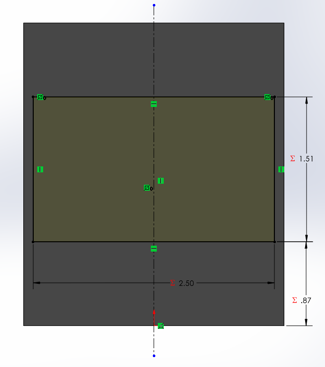
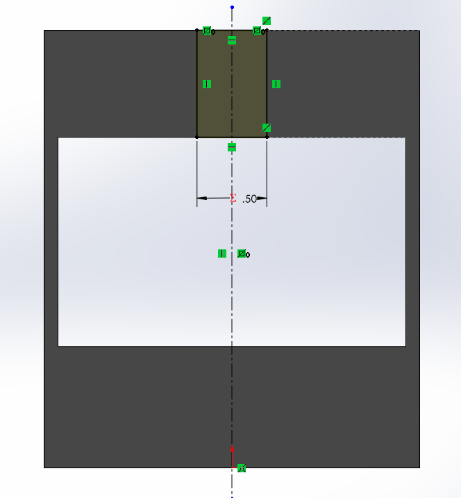
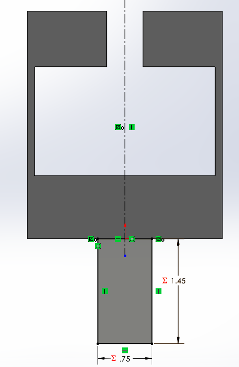
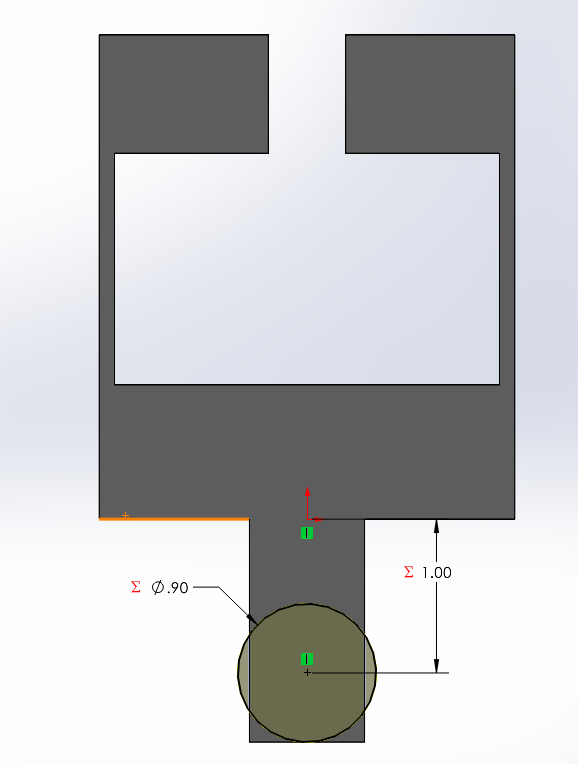
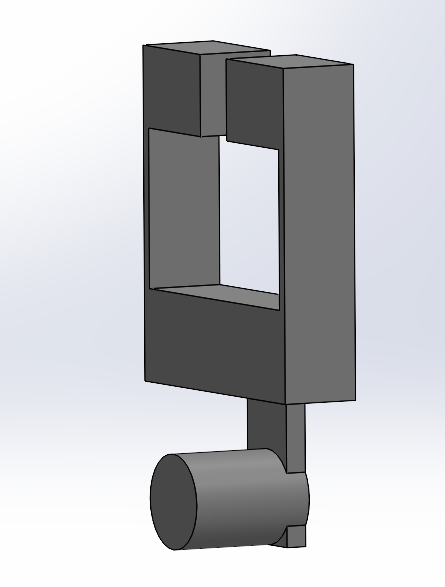
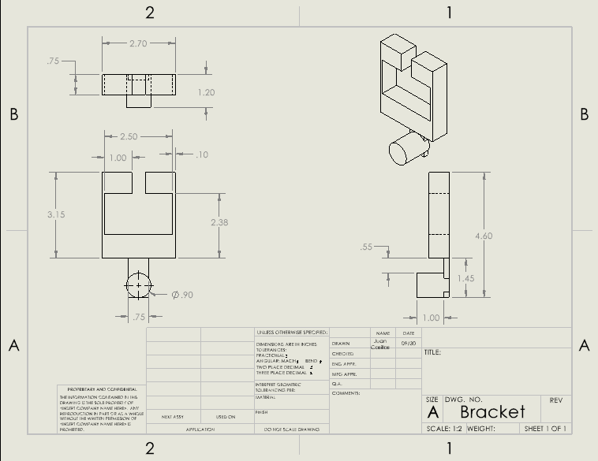

# A6 – Parametric Bracket Design and Drawing

## Objective

The objective of this assignment is to turn the bracket design from [Assignment 5](../A05/index.md) into a parametric solid model and a multiview engineering drawing in SolidWorks. The bracket fits over a rigid T-shaped beam and supports the polyester strap through a cylindrical pin. This page documents the bracket modeling process and the current drawing. The separate link will be documented later.

## Design Process

**Design Inputs**

I carried forward the 700 lbf load on each strap side, giving a total load of 1,400 lbf, and the selected 6061-T6 aluminum from Assignment 5. The preliminary analysis used a safety factor of 4, a yield strength of 40,000 psi, an elastic modulus of 10,000,000 psi, and a 0.005 in deflection limit for each feature.

The revised T-beam specification gives a = 0.498 in, b = 0.9992 in, and c = 1.499 in. For the symmetric cross-section, the nominal overall beam width is a + 2b = 2.4964 in. I used a 0.5020 in top slot, a 2.5024 in lower cavity width, and a 1.5050 in cavity height as preliminary opening dimensions. These model dimensions provide nominal clearance, but the three sliding-fit tolerances still need to be finalized on the drawing.

**Dimension Selection**

Feature A is the pin, B is the hanger, C is the lower crossmember, D represents the side webs, and E represents the upper lips. The selected modeling dimensions are listed below. Values are in inches.

| Global variable | Model value | Feature controlled |
| --- | --- | --- |
| Bracket_depth | 0.750 | Main body extrusion depth |
| Pin_diameter | 0.8995 | Feature A diameter |
| Pin_free_length | 1.000 | Pin projection beyond the hanger |
| Hanger_width | 0.750 | Feature B section width |
| Hanger_thickness | 0.200 | Hanger extrusion thickness |
| Hanger_length | 1.000 | Body underside to pin center |
| Web_thickness | 0.100 | Feature D thickness |
| Lip_height | 0.770 | Feature E height |
| Top_slot_width | 0.5020 | Narrow top opening |
| T_cavity_width | 2.5024 | Lower opening width |
| T_cavity_height | 1.5050 | Lower opening height |
| Crossmember_height | Approximately 0.8736 | Feature C height, driven by the strength equation |

The 0.8995 in pin diameter is the midpoint of the 0.8993–0.8997 in limits selected in Assignment 5. The CAD model uses this size, while the drawing still needs the explicit fit limits.

The revised opening also changes the lip overhang to approximately (2.5024 - 0.5020) / 2 = 1.0002 in. Applying the previous cantilever strength model to this longer overhang gives a minimum lip height of approximately 0.7484 in. I used 0.770 in for the model.

## Parametric Equations

**Global Variables**

I entered the dimensions as global variables so the sketches and extrusions could refer to named dimensions rather than separately entered values. The screenshot shows the parameter table and the analytical expression for the crossmember.



*Figure 1. Global variables controlling the bracket. The Evaluates to column is rounded by the display precision; for example, the pin input is 0.8995 in even though it displays as 0.90 in.*

**Equation Driving Feature C**

For the lower crossmember, I used the center-loaded, simply supported rectangular beam strength model from Assignment 5:

```text
h_C = sqrt(3 × P × L / (2 × w × allowable stress))
```

The total load P is 1,400 lbf, the assumed support span L is 2.6024 in, the section depth w is 0.750 in, and the allowable stress is 40,000 / 4 = 10,000 psi. The support span is the cavity width plus one web thickness, representing the distance between web centerlines.

I entered the equation directly in SolidWorks and added a 0.020 in design allowance:

```text
"Crossmember_height" = (3 * 1400 * 2.6024 / (2 * 0.75 * 10000)) ^ (1 / 2) * 1in + 0.020in
```

The equation evaluates to approximately 0.8736 in and controls the material below the T opening. The main body height also references this parameter, so the body height depends on the calculated crossmember height.

The original 2.50 in span in Assignment 5 gave a strength minimum of approximately 0.837 in. With the revised 2.6024 in span, the minimum increases to approximately 0.8536 in before the design allowance.

The expression currently contains the load and span as numerical constants. If the cavity width or web thickness changes, the 2.6024 in span must be updated manually in this expression. The sketches that reference Crossmember_height are set up to follow its result; a separate before-and-after rebuild test has not yet been documented.

## CAD Modeling

**Main Body Sketch and Extrusion**

I started on the Front Plane with a rectangular body sketch and positioned the midpoint of its bottom edge at the origin. This placed the origin at the body underside, which later became the reference for the hanger and pin.

The width was defined as T_cavity_width + 2 × Web_thickness. The height was defined as Crossmember_height + T_cavity_height + Lip_height. These relationships give an approximate body width of 2.7024 in and height of 3.1486 in.



*Figure 2. Main body sketch. The displayed 2.70 in width and 3.15 in height are rounded representations of the parameter-controlled dimensions.*

I extruded this sketch to the 0.750 in Bracket_depth.

**Lower T Cavity**

On the body face, I sketched the wide rectangular opening and centered it about a vertical construction line. I controlled its width with T_cavity_width and its height with T_cavity_height. The distance from the body bottom to the cavity bottom was tied to Crossmember_height.



*Figure 3. Lower cavity sketch showing the opening dimensions and the equation-controlled material below it.*

I used a Through All cut to create the lower opening. This left the lower crossmember and the two side webs.

**Top Slot**

I added a centered rectangle connecting the upper edge of the lower cavity to the top of the body. Its width was controlled by Top_slot_width.



*Figure 4. Narrow top slot sketch. Cutting this region through the body completes the T-shaped opening and leaves the two upper lips.*

I cut this sketch Through All so the T-shaped opening continued through the full body depth.

**Rear Hanger**

I sketched the hanger on the rear face of the body, centered it horizontally, and placed its top edge at the body underside. The width was controlled by Hanger_width. The full rectangular hanger height was Hanger_length + Pin_diameter / 2, or approximately 1.44975 in.



*Figure 5. Hanger sketch showing the 0.750 in width and approximately 1.45 in total rectangular height.*

I extruded the hanger 0.200 in toward the front of the bracket with Merge result enabled. This placed the hanger at the rear of the body.

**Pin Sketch and Extrusion**

On the rear hanger face, I sketched the pin circle and aligned its center vertically with the origin. I positioned its center 1.000 in below the main body underside and set the diameter to Pin_diameter = 0.8995 in.



*Figure 6. Corrected pin sketch. The 1.000 in location is measured from the main body underside to the circle center, and the displayed diameter is rounded to 0.90 in.*

I extruded the pin toward the front by Pin_free_length + Hanger_thickness = 1.200 in, with Merge result enabled. This creates 1.000 in of exposed pin beyond the hanger's front surface.

**Bracket Model**

The current solid model includes the T opening, lower crossmember, side webs, upper lips, rear hanger, and cylindrical pin.



*Figure 7. Current bracket model after the pin extrusion. The rectangular hanger extends slightly below the pin because of the selected hanger outline.*

## Engineering Drawing

**Multiview Layout**

I created a drawing with a front view, a top view above it, a right-side view to its right, and an isometric view for orientation. This arrangement follows a third-angle projection layout. The current sheet uses a 1:2 scale and identifies the part as Bracket.



*Figure 8. Current drawing showing the bracket views, dimension placement, and title block.*

The drawing currently shows dimensions for the body, side web, lip overhang, pin, hanger, and overall height. Its dimensions are displayed at limited precision, so the image should not be interpreted as the final specification of the fit surfaces.

**Tolerancing Still to Complete**

The drawing needs explicit limits or tolerances for the three T-beam sliding interfaces and the pin's 0.8993–0.8997 in diameter limits. The narrow top slot and the lower cavity height also need clear manufacturing dimensions. I still need to complete the material and title-block information and include the required general tolerance block:

```text
UNLESS OTHERWISE SPECIFIED:
DIMENSIONS ARE IN INCHES
X.X     ± .02
X.XX    ± .01
X.XXX   ± .005
```

Functional mating surfaces need tolerances based on the required fit rather than only the general block. Non-critical exterior dimensions can use a looser class when their variation does not affect assembly or strength. The final tighter-versus-looser tolerance examples will be documented after those callouts are applied.

## Mistakes and Corrections

**Equation Syntax**

The first Crossmember_height expression produced a syntax error in SolidWorks. I simplified the expression and entered the global-variable name separately from its Value/Equation entry. The current parameter table shows the expression evaluating to approximately 0.87 in at the displayed precision.

**Pin Location Reference**

I initially dimensioned the circle center 1.000 in below the hanger's bottom edge. This placed the pin circle below the hanger. I removed that dimension and measured from the main body underside at the origin instead. The corrected sketch places the pin center 1.000 in below the body, overlapping the hanger for the boss extrusion.

**Lip Dimension Correction**

The handwritten 0.50 in lip selection in Assignment 5 was below its calculated 0.648 in strength minimum. The revised T-beam geometry increased the assumed overhang further. I used a 0.770 in lip height for the current model rather than carrying the 0.50 in selection into CAD.

## Lessons Learned

**References Communicate Design Intent**

The pin-location error showed that a dimension needs both a value and the correct reference. A 1.000 in distance from the hanger bottom placed the pin outside the intended attachment region, while the same distance from the body underside produced the intended position.

**Analytical Dimensions and Geometric Relationships**

The crossmember equation places the strength calculation directly in CAD. Referencing its result in the cavity location and overall body height connects the analytical dimension to the solid geometry. However, the numerical span inside the equation does not update by itself when the cavity changes; that input still requires manual editing.

**Updated Specifications Affect More Than the Opening**

Changing the T-beam specification affects the opening width, the crossmember support span, and the upper-lip overhang. These changes can alter the required structural dimensions, so replacing only the opening dimensions would leave parts of the earlier analysis out of date.

**Model Precision and Drawing Precision**

The parameter table and sketches round displayed values. A displayed diameter of 0.90 in does not communicate the pin's 0.8993–0.8997 in fit limits. The drawing must specify those limits explicitly. Applying an unnecessarily tight tolerance to a non-critical exterior feature can increase machining and inspection effort without improving the bracket's function.

## Time Spent

I have spent approximately **3 hours** on the bracket modeling and drawing so far. This is the current total, not the final start-to-finish time for Assignment 6.

## CAD Download Files

The native bracket part, drawing, and drawing PDF have not yet been uploaded to this assignment page. Download links will be added when those files are available. The screenshot above documents the current drawing; it does not replace a downloadable CAD file or the required final PDF.
